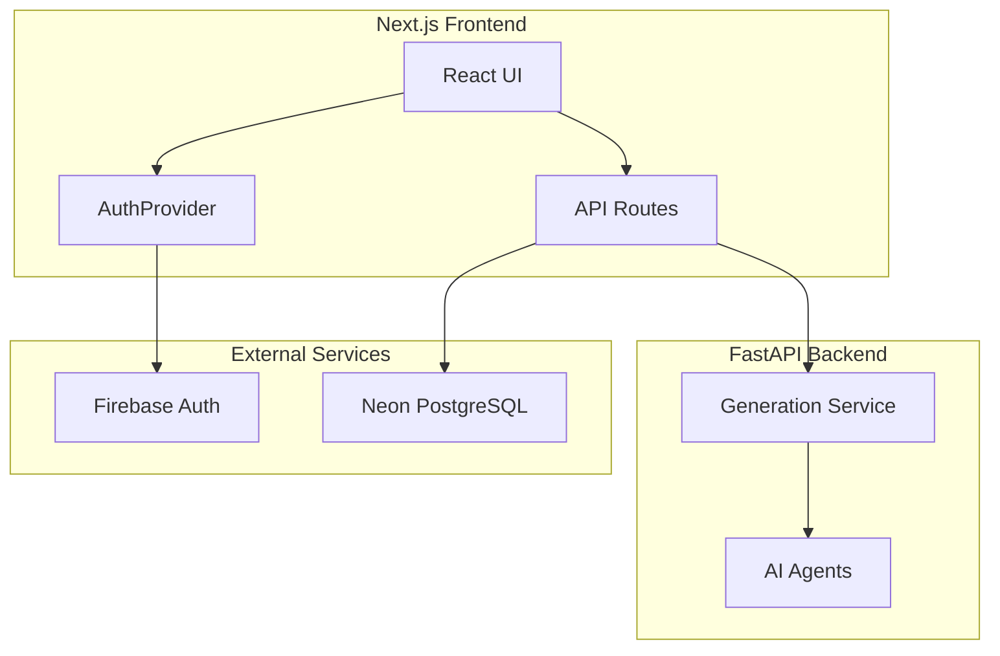

# Architecture

SankoSlides Frontend is a Next.js 16 application using the App Router pattern. It serves as the user-facing layer of the SankoSlides platform, communicating with a Python FastAPI backend for AI orchestration.

## System Overview

## Data Flow

### Authentication Flow

1. User signs in via Firebase (Email/Password or Google OAuth)
2. `AuthProvider` detects auth state change
3. Frontend calls `/api/auth/sync` with Firebase ID token
4. Backend verifies token + upserts user to Neon DB
5. `dbUser` state populated with database user record

### Generation Flow

1. **Start Session** → Create project, initialize session
2. **Clarification** → Conversational refinement (ClarifierChat component)
3. **Blueprint Review** → User approves generated outline
4. **Generation** → Backend spawns AI agents (planner → generator → visual_qa)
5. **SSE Progress** → Real-time updates via EventSource
6. **Completion** → Slides displayed in SlideViewer

## Key Design Patterns

### Backend-for-Frontend (BFF)

API routes in `app/api/` act as a BFF layer:
- Authenticate requests using Firebase Admin SDK
- Forward calls to Python backend
- Handle response transformation

### Context-Based State

- `AuthProvider` — Global auth state
- `ThemeProvider` — Dark/light mode (next-themes)

### Component Composition

Editor workspace uses composition:
- `EditorLayout` → `EditorWorkspace`
- Contains: `ClarifierChat`, `BlueprintReview`, `GenerationProgress`, `SlideViewer`

## Environment Configuration

| Variable | Purpose |
|----------|---------|
| `NEXT_PUBLIC_FIREBASE_*` | Firebase client config |
| `DATABASE_URL` | Neon PostgreSQL connection |
| `NEXT_PUBLIC_API_URL` | Backend API base URL |
